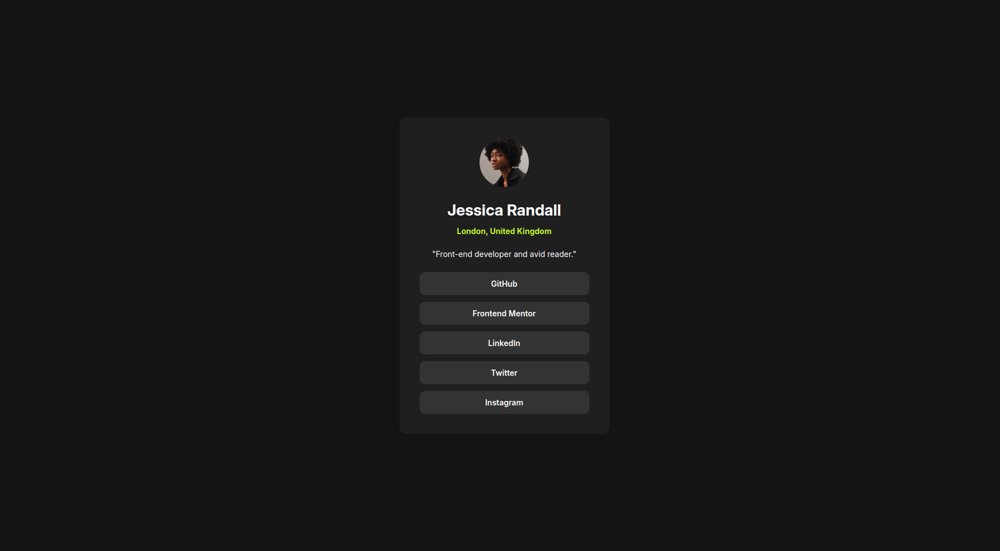

# Frontend Mentor - Social links profile solution

This is a solution to the [Social links profile challenge on Frontend Mentor](https://www.frontendmentor.io/challenges/social-links-profile-UG32l9m6dQ). Frontend Mentor challenges help you improve your coding skills by building realistic projects. 

### The challenge

Users should be able to:

- See hover and focus states for all interactive elements on the page

### Screenshot

### Links

- Solution URL: [github](https://github.com/mostafa-hsh/social-links-profile)
- Live Site URL: [github pages](https://mostafa-hsh.github.io/social-links-profile/)

### Built with

- Flexbox

### What I learned

It was another exercise for my flex and css knowledge.

## Author

- Frontend Mentor - [@mostafa-hsh](https://www.frontendmentor.io/profile/mostafa-hsh)
thanks FRONTEND-MENTOR